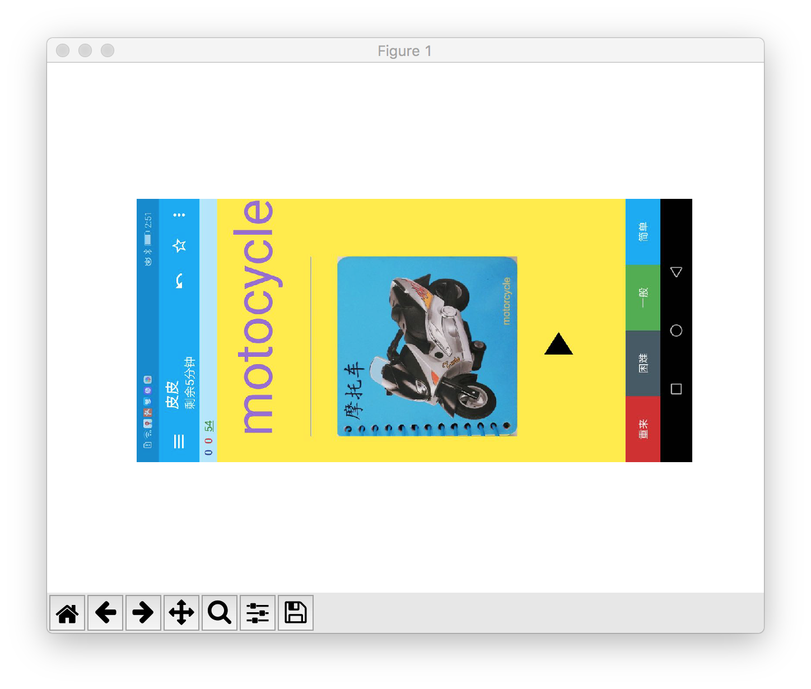
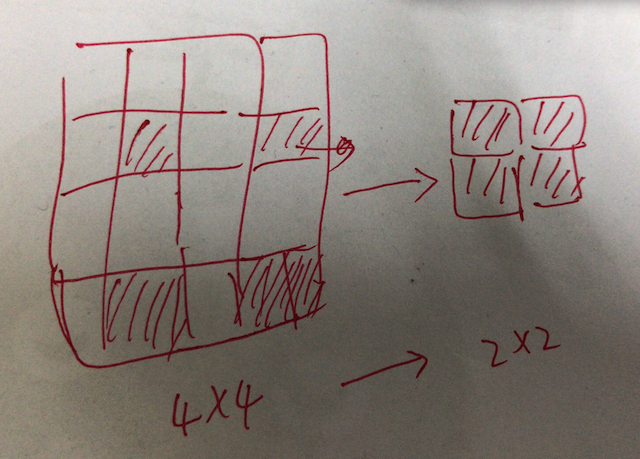
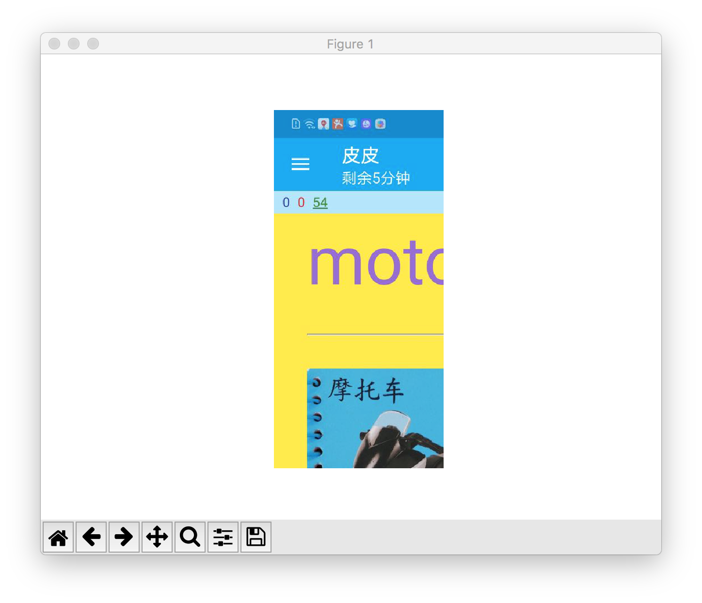
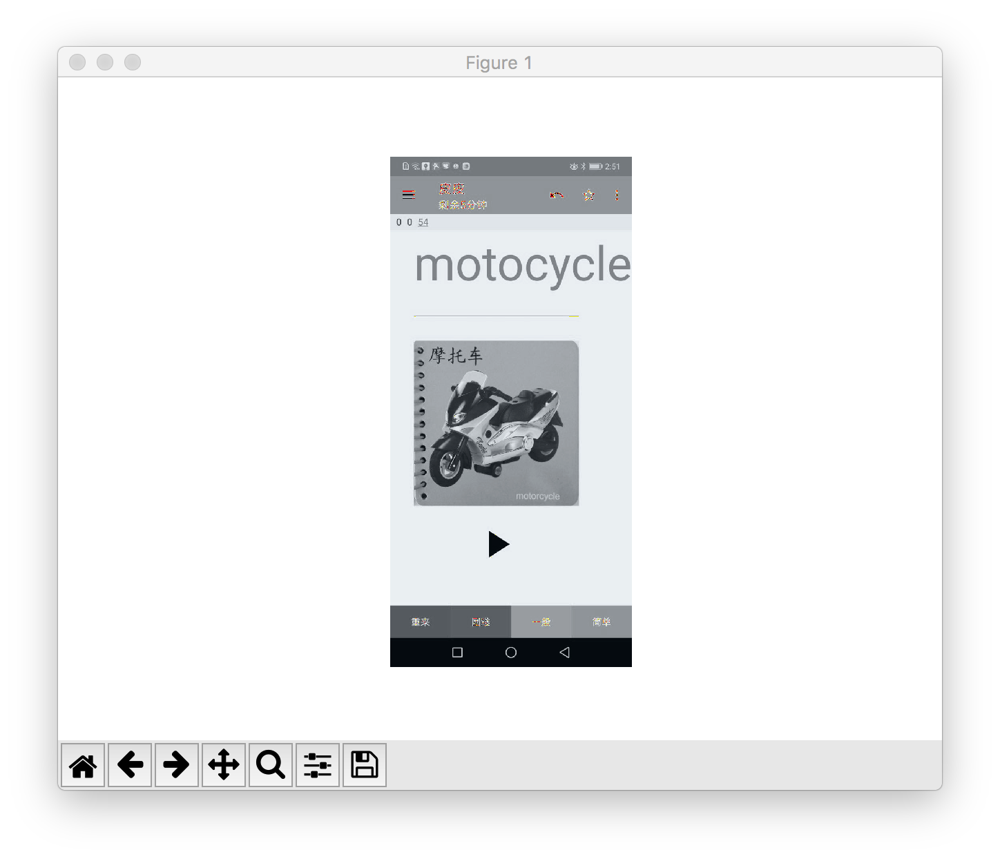
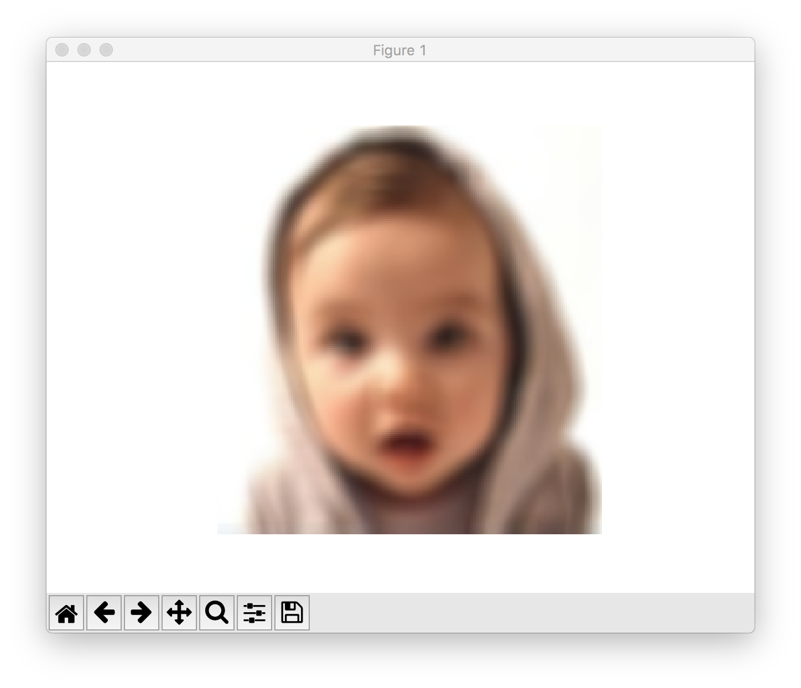

这个项目是使用 numpy 实现的一些有趣且实用的例子。

# 图片处理
我从事 Android 开发。Android 中经常有对图片缩放、旋转、灰化、模糊等操作。如何使用 numpy 对图片进行处理呢？

(最近在看 numpy，感觉学习它的 API 很枯燥。用来处理图片或许会带来一点乐趣，边玩边学哈哈。)

python 中有多种方式处理图片，包括：

+ opencv
+ matplotlib
+ PIL

我在这里使用的是 matplotlib (因为机器上已经装好了。:) )

```python
import matplotlib.pyplot as plt # plt 用于显示图片
import matplotlib.image as mpimg # mpimg 用于读取图片
import numpy as np

lena = mpimg.imread('lena.png') # 读取和代码处于同一目录下的 lena.png
# 此时 lena 就已经是一个 np.array 了，可以对它进行任意处理
lena.shape #(512, 512, 3)

plt.imshow(lena) # 显示图片
plt.axis('off') # 不显示坐标轴
plt.show()
```

以上这个代码来自[这里](https://www.cnblogs.com/yinxiangnan-charles/p/5928689.html)

这里介绍一下 np.ndarray 和 np.ndarray.shape。

numpy 文档只会很官方地告诉你以下信息：

+ np.ndarray - An array object represents a multidimensional, homogeneous array of fixed-size items
+ np.ndarray.shape - Tuple of array dimensions

在上面的代码中 np.ndarray 和 np.ndarray.shape 就变得很直观了

+ np.ndarray - 你将 lena.png 想像与一个二维数组/矩阵就行了
+ np.ndarray.shape - 对于 lean.png 而言，它的 shape 是一个三元组。第一个元素是宽，第二个元素是高，最后一个暂时忽略

对 sample.jpeg 进行同样处理，也会有类似输出：


```
>>> s = mpimg.imread('sample.jpeg')
>>> s.shape
(1280, 606, 3)
>>>
```

对另一个图片 `sample.png` 进行处理，看看输出结果：

```
>>> mpimg.imread('sample.png').shape
(458, 558, 4)
```

再来解释一下 shape 三元组的最一个值的含义。

```
>>> a_jpg = mpimg.imread('sample.jpeg')
>>> a_png = mpimg.imread('sample.png')
>>> a_jpg[0][0]
array([  2, 136, 209], dtype=uint8)
>>> a_png[0][0]
array([0., 0., 0., 0.], dtype=float32)
```

输出 a_jpg 和 a_png 的第一个像素，会发现前者一个像素是 1x3 矩阵，而后者一个像素是 1x4 矩阵。原因在于 JPG 图片每个像素由 RGB 三个分量构成，而 PNG 图片每个像素由 ARGB 四个分量构建。

所以 shape 三元组最一个值可以理解为像素通道数量。

## 图片旋转
Android 中这样旋转图片：

```java
Matrix matrix = new Matrix();
matrix.postRotate(angle);
Bitmap rotated = Bitmap.createBitmap(bitmap, 0, 0,
                bitmap.getWidth(), bitmap.getHeight(), matrix, true);
```

而 numpy 中旋转图片的本质是旋转代表图片的矩阵。

```
>>> s.shape
(1280, 606, 3)
>>> s2 = np.rot90(s, 1) # 逆时针旋转 90 度
>>> s2.shape
(606, 1280, 3)
>>>
```

显示旋转后的结果：



参考：[rot90函数](https://docs.scipy.org/doc/numpy-1.13.0/reference/generated/numpy.rot90.html#numpy.rot90)

## 图片缩放
Android 缩小图片的一种常用方法是利用 `BitmapFactory.Options.inSampleSize`。根据需求计算出一个缩放因子作为 `inSampleSize`。

```java
BitmapFactory.Options options = new BitmapFactory.Options();
options.inSampleSize = ...;
Bitmap scaled = BitmapFactory.decodeFile(fileFath, options);
```

而 numpy 中缩小图片可以理解为缩小代表图片的矩阵。如下图，这里将一个 4x4 矩阵缩小成 2x2 矩阵：



这段代码将 a1 矩阵(4x4)缩放成 a2 矩阵(2x2)。 

```
>>> a = np.array(range(16))
>>> a1 = a.reshape([4, 4])
>>> a2 = a1[1::2,1::2]
>>> a1
array([[ 0,  1,  2,  3],
       [ 4,  5,  6,  7],
       [ 8,  9, 10, 11],
       [12, 13, 14, 15]])
>>> a2
array([[ 5,  7],
       [13, 15]])
```

使用同样方式将代表原始图片的 s 缩放成 1/4 大小的 s1。

```
>>> s.shape
(1280, 606, 3)
>>> s1 = s[1::2, 1::2]
>>> s1.shape
(640, 303, 3)
>>>
```

TODO: 这里的例子可能过于简单。看 Android 源码分析 inSampleSize 的具体实现。

## 图片剪裁

TODO: 补充 Android 中的 Bitmap 剪裁。

```
>>> a1
array([[ 0,  1,  2,  3],
       [ 4,  5,  6,  7],
       [ 8,  9, 10, 11],
       [12, 13, 14, 15]])
>>> a1[:2:, :2:]
array([[0, 1],
       [4, 5]])
>>>
```

对图片剪裁：

```
>>> s.shape
(1280, 606, 3)
>>> s1 = s[:640:, :303:]
>>> s1.shape
(640, 303, 3)
```

显示剪裁后的结果：



## 图片灰化

使用 `ColorMatrixColorFilter` 将 ImageView 灰化：

```java
public static void grey(ImageView iv) {
    ColorMatrix cm = new ColorMatrix();
    cm.setSaturation(0);
    ColorMatrixColorFilter filter = new ColorMatrixColorFilter(cm);
    iv.setColorFilter(filter);
}
```    

使用 `ColorMatrixColorFilter` 将 Bitmap 灰化：

```java
private void grey(Bitmap sourceBitmap, Bitmap blurredBitmap) {
    Canvas c = new Canvas(blurredBitmap);
    Paint paint = new Paint();
    ColorMatrix cm = new ColorMatrix();
    cm.setSaturation(0);
    ColorMatrixColorFilter f = new ColorMatrixColorFilter(cm);
    paint.setColorFilter(f);
    c.drawBitmap(sourceBitmap, 0, 0, paint);
}
```

[android.graphics.ColorMatrix](https://developer.android.com/reference/android/graphics/ColorMatrix) 是图片灰化的核心。

> ColorMatrix 是一个 4x5 矩阵用于对 Bitmap 的颜色和alpha分量进行转换。可以使用一维数组构造这个矩阵。一维数组被视为如下矩阵

```
  [ a, b, c, d, e,
    f, g, h, i, j,
    k, l, m, n, o,
    p, q, r, s, t ]
```

这个矩阵应用于一个像素 `[R, G, B, A]` 时，得到的结果为：

```
   R’ = a*R + b*G + c*B + d*A + e;
   G’ = f*R + g*G + h*B + i*A + j;
   B’ = k*R + l*G + m*B + n*A + o;
   A’ = p*R + q*G + r*B + s*A + t;
```

创建一个 `ColorMatrix` 并调用 `setSaturation(0)` 后，会得到什么结果？

```java
public class ColorMatrix {
    private final float[] mArray = new float[20];

    public ColorMatrix() {
        reset();
    }

    public void reset() {
        final float[] a = mArray;
        Arrays.fill(a, 0);
        a[0] = a[6] = a[12] = a[18] = 1;
    }

    /**
     * Set the matrix to affect the saturation of colors.
     *
     * @param sat A value of 0 maps the color to gray-scale. 1 is identity.
     */
    public void setSaturation(float sat) {
        reset();
        float[] m = mArray;

        final float invSat = 1 - sat;
        final float R = 0.213f * invSat;
        final float G = 0.715f * invSat;
        final float B = 0.072f * invSat;

        m[0] = R + sat; m[1] = G;       m[2] = B;
        m[5] = R;       m[6] = G + sat; m[7] = B;
        m[10] = R;      m[11] = G;      m[12] = B + sat;
    }    
```

 后，会得到什么结果？使用 numpy 算一下。

```
>>> cm = np.array(range(20), float) # 注意这里的 float 参数
>>> cm[0] = cm[6] = cm[12] = cm[18] = 1
>>> cm[0] = cm[5] = cm[10] = 0.213
>>> cm[1] = cm[6] = cm[11] = 0.715
>>> cm[2] = cm[7] = cm[12] = 0.072
>>> cm1 = cm.reshape([4,5])
>>> cm2 = cm1[0:3,0:3]
>>> cm3 = cm1[0:3, 4]
>>> cm1
array([[ 0.213,  0.715,  0.072,  3.   ,  4.   ],
       [ 0.213,  0.715,  0.072,  8.   ,  9.   ],
       [ 0.213,  0.715,  0.072, 13.   , 14.   ],
       [15.   , 16.   , 17.   ,  1.   , 19.   ]])       
```


这里解释一下 cm1, cm2, cm3 的含义：

```
cm1 =
  [ a, b, c, d, e,
    f, g, h, i, j,
    k, l, m, n, o,
    p, q, r, s, t ]

cm2 = 
  [ a, b, c, 
    f, g, h,
    k, l, m ]

cm3 = 
  [ e,
    j,
    o ]
```

套用来自 ColorMatrix 的算法，对图片 s 进行灰化处理的本质其实就是对 s 的每个像素点进行如下处理：

```
s[i][j] = cm2.dot(s[i][j].dot() ) + cm3
```

完整的代码如下：

```python
s = m

grayed = s.copy()
grayed.fill(0)
for i in range(1280):
    for j in range(606):
        grayed[i][j] = round(cm2.dot(s[i][j]) + cm3)
```

灰化后的图片如下：



处理结果还不是特别完美，但整体上成功了！

TODO 数据类型转换问题？

```
s[0][0].dtype  # 输出 dtype('uint8')
(cm2.dot(s[0][0]) + cm3).dtype # 输出 dtype('float64')
```

## 图片模糊
最后一个图片处理的例子是图片模糊处理。这里只讲最简单的模糊处理方式。

> 图片的每一个像素都取周边像素的平均值，来减少像素间差距，达到模糊效果 [来源](https://zhuanlan.zhihu.com/p/43907816)

`get_color` 实现取周边像素平均值的操作。完整代码见 [blur.py](blur.py)

```python
def get_color(point, radius, arr, w, h):
    x, y = point
    left = max(y - radius, 0)
    right = min(y + radius, w)
    top = max(x - radius, 0)
    bottom = min(x + radius, h)

    r = 0
    g = 0
    b = 0
    count = 0
    for i in range(top, bottom):
        for j in range(left, right):
            if x == i and y == j:
                continue
            r += arr[i][j][0]
            g += arr[i][j][1]
            b += arr[i][j][2]
            count += 1
    return (round(r / count), round(g / count), round(b / count))
```    

对图片进行模糊处理并显示出来。

```
>>> s = mpimg.imread('1_swqqcs.jpg')
>>> width = s.shape[1]
>>> height = s.shape[0]
>>> for i in range(height):
...     for j in range(width):
...             blurred[i][j] = blur.get_color((i, j), 5, s, width, height)
...
>>> plt.imshow(blurred)
>>> plt.axis('off')
>>> plt.show()
```

模糊效果如下：



对图片进行模糊处理时经常会听到一个术语模糊半径。`get_color()` 的 `radius` 即模糊半径。相信结合代码你不难理解到底什么是模糊半径。

# 总结
至此，你应该掌握了关于 numpy 和 matplotlib 的以下用法：

+ 读取图片和展示图片
+ 创建 array
+ 自定义 dtype
+ 创建 array 并指定 dtype
+ array 切片操作
+ array 旋转操作
+ array 填充操作
+ array reshape 操作
+ array 拷贝操作
+ 矩阵点乘
+ ColorMatrix 背后的原理

你可以将以下内容作为自测练习，检查自己到底是否有掌握这些概念或用法。以下是答案对照表：

+ mpimg.imread(), plt.imshow(), plt.show()
+ np.array()
+ np.dtype((np.int32, (2, 2))) 
+ array[:,:]
+ np.rot90(array, 1)
+ array.fill()
+ array.reshape([4, 4])
+ array.copy()
+ array.dot()

动手练习使用 numpy 是不是比只看 numpy 文档来得更有意思且印象更深刻一些？

TODO 什么是 inSampleSize

# 参考
+ [python 读取并显示图片的两种方法 - 邊城浪子 - 博客园](https://www.cnblogs.com/yinxiangnan-charles/p/5928689.html)
+ [rot90函数](https://docs.scipy.org/doc/numpy-1.13.0/reference/generated/numpy.rot90.html#numpy.rot90)
+ [如何自定义 dtype](https://docs.scipy.org/doc/numpy-1.13.0/reference/arrays.dtypes.html)
+ [什么是图像模糊](https://zhuanlan.zhihu.com/p/43907816)
+ [高斯模糊的算法 - 阮一峰的网络日志](http://www.ruanyifeng.com/blog/2012/11/gaussian_blur.html)
